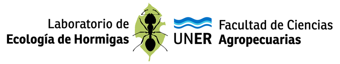

<p align="center"></p>

# AntCam 2 — grabación autónoma de caminos de forrajeo

Versión nueva del AntVideoRecord (Sabattini et al., *HardwareX* 2022). Graba video en forma continua durante días, solo, sin pantalla ni VNC, y se configura desde el navegador del celular.

**Qué hace:**

- Arranca y graba solo al enchufarlo. Si se corta la luz o se cuelga, al volver retoma solo.
- Graba en fragmentos `.mp4` (de 30 min por defecto) sin perder cuadros entre uno y otro. Si se corta la luz, el fragmento abierto se puede ver igual hasta el último segundo.
- Usa la hora real de cada cuadro. Si la cámara baja los cuadros por segundo, el video sigue durando lo que duró de verdad.
- Graba solo la zona del camino que marcás con el dedo: ocupa menos y se ve con más detalle.
- Usa varios pendrives en cadena. Cuando se llena uno, sigue en otro sin cortar.
- WiFi automático: se conecta a redes conocidas o, si no hay ninguna, crea su propia red.
- Manda avisos por Telegram cuando tiene internet.
- La hora se ajusta sola con la del celular al abrir la página.
- Marca chica en el video, abajo a la izquierda, con la fecha y hora, y opcionalmente lugar, especie y una nota.
- La hormiga del laboratorio, chica y semitransparente, abajo a la derecha del video (se puede desactivar).

---

## Qué hace falta

| Cosa | Nota |
|---|---|
| Raspberry Pi 3B+ (sirve también 3B, 4 o Zero 2 W) | |
| Cámara Raspberry Pi v2 + cable plano | |
| microSD de 16 o 32 GB (clase 10 / A1) | para el sistema; los videos van al pendrive |
| Fuente de 5 V y 2.5 A con micro-USB | buena; las de celular baratas causan bajas de tensión |
| 1 o más pendrives, **formateados en exFAT** | ver "Formatear un pendrive" |
| Una PC con internet y la misma red WiFi | solo para instalar |

---

## Instalación fácil: imagen lista (recomendada)

No hace falta terminal ni comandos.

1. **Descargá la imagen.** Entrá a **github.com/HormigaArgentina/antcam → Releases** y bajá el archivo que termina en `.img.xz` (de la versión más nueva). Alcanza con bajarlo una vez.
2. **Grabá la tarjeta.**
   - Abrí **Raspberry Pi Imager** (raspberrypi.com/software).
   - Dispositivo: tu Raspberry.
   - Sistema operativo: *Usar personalizado* → elegí el archivo descargado.
   - Almacenamiento: la microSD → **Escribir**.
   - Si pregunta si querés personalizar, respondé **No**.
3. **(Opcional) Completá los ajustes.** Con la tarjeta todavía en la PC, abrí la unidad **bootfs** y editá `antcam.txt` con el Bloc de notas. Ahí van el nombre del equipo, la WiFi de la oficina, si la red propia lleva clave, Telegram y la marca del video (lugar, especie). Sirve para dejar varios equipos preparados igual. Si no lo tocás, también funciona.
4. **Armá y encendé.** Poné la tarjeta, la cámara y el pendrive, y enchufá.
   - El primer encendido tarda 2–3 minutos: prepara la tarjeta y se reinicia una vez.
   - Después aparece la WiFi **AntCam-XXXX**, con un nombre propio de cada placa. Es **abierta** (sin clave): en la Pi 3B+ la red propia con clave no deja conectarse.
   - Ya está grabando. Seguí con "Uso en el campo".

Acceso de mantenimiento por SSH, si alguna vez hace falta: usuario `antcam`, clave `hormigas`.

> **Cómo se fabrica la imagen:** GitHub la arma sola (`.github/workflows/imagen.yml`) cada vez que cambia el archivo **`VERSION`**. Se puede editar desde la web de GitHub: lápiz → cambiar el número → *Commit*. Tarda alrededor de 1 hora y aparece en Releases. Las versiones con guion (por ejemplo `2.1.0-beta.1`) salen como versión de prueba ("pre-release"). El avance se ve en la pestaña **Actions**.

---

## Instalación manual (alternativa, ~30 min)

Sirve para instalar sobre un Raspberry Pi OS que ya tengas, o para desarrollar.

### Paso 1 — Grabar la microSD

1. En la PC instalá **Raspberry Pi Imager** (raspberrypi.com/software).
2. Elegí:
   - **Dispositivo:** Raspberry Pi 3.
   - **Sistema operativo:** *Raspberry Pi OS (other)* → **Raspberry Pi OS Lite (64-bit)**.
   - **Almacenamiento:** la microSD.
3. Cuando ofrezca **personalizar / editar ajustes**, completá:
   - **Nombre de host:** `antcam-01`
   - **Usuario y contraseña:** por ejemplo `pi` y una clave que recuerdes.
   - **WiFi:** el de la oficina (nombre y clave), país **AR**.
   - **Zona horaria:** America/Argentina/Buenos_Aires.
   - **Servicios:** activar **SSH** con contraseña.
4. Grabá y esperá a que termine.

### Paso 2 — Armar y encender

1. Conectá la cámara al conector **CAMERA** de la Pi (no al de DISPLAY). Los contactos dorados del cable miran hacia el lado contrario a los USB.
2. Poné la microSD y un pendrive.
3. Enchufá la fuente y esperá unos 2 minutos.

### Paso 3 — Copiar AntCam a la Pi

En la PC abrí una terminal (en Windows: menú Inicio → *Terminal*) y conectate a la Pi:

```
ssh pi@antcam-01.local
```

Pide la contraseña del paso 1. La primera vez pregunta si confiás en el equipo: respondé `yes`.

### Paso 4 — Instalar

Ya dentro de la Pi, escribí:

```
sudo apt install -y git
git clone https://github.com/HormigaArgentina/antcam
cd antcam
sudo ./install.sh AntCam-01
sudo reboot
```

(Sin internet en la Pi: copiá el zip con `scp antcam.zip pi@antcam-01.local:` y usá `unzip antcam.zip` en lugar de `git clone`.)

El nombre (`AntCam-01`) aparece en los archivos, en la red WiFi propia y en los avisos. Usá uno distinto para cada equipo: AntCam-02, AntCam-03…

### Paso 5 — Listo

Desde la PC o el celular, en la misma WiFi, abrí **http://antcam-01.local**. Ya está grabando con la imagen completa. Andá a **Encuadre** y marcá la zona del camino.

---

## Uso en el campo

1. Conectá los pendrives, la cámara y la luz. Encendé el equipo.
2. Esperá ~2 minutos. El **LED verde de la placa late como un corazón: está grabando.**
3. Con el celular, en Ajustes → WiFi, conectate a la red **AntCam-01** (abierta, sin clave). En general la página se abre sola; si no, entrá a **http://10.42.0.1**.
   - Si no abre, **apagá los datos móviles** del celular un momento.
4. Al abrir la página, **la hora del equipo se ajusta con la del celular**.
5. En **Encuadre**: tocá *Empezar a encuadrar*, arrastrá el dedo sobre el camino y tocá *Guardar y grabar*.
6. En **Estado** tiene que decir **Grabando** en verde. Tocá *Ver cámara* para ver lo que se graba.
7. Tapá el equipo y listo. Te podés desconectar: sigue grabando.

### Retirar los videos

- En **Estado**, tocá **Quitar** en el pendrive. Cuando diga *listo para quitar*, sacalo. Si hay otro pendrive conectado, el equipo sigue grabando en ese.
- Si conectás un pendrive vacío, se empieza a usar solo.
- Para desenchufar todo: **Sistema → Apagar**, esperá 20 s y desenchufá.

### Dónde quedan los videos

```
AntCam/
  AntCam-01/
    indice.csv                      ← lista de fragmentos: inicio, fin, cuadros, fps reales, lugar, especie, nota
    2026-10-08/
      antcam-01_20261008_083000.mp4
      antcam-01_20261008_090000.mp4
      ...
    pruebas_calidad/                ← si hiciste la prueba de calidad
```

Los `.mp4` se abren con VLC, ffmpeg, OpenCV y Python. Están grabados en modo "fragmentado" para resistir cortes de luz. Si algún programa viejo no los abre, se convierten sin perder calidad con:

```
ffmpeg -i video.mp4 -c copy video_normal.mp4
```

---

## Marca en el video

En **Video → Marca en el video** se elige qué aparece abajo a la izquierda de cada cuadro:

- **Fecha y hora**, con segundos (activada por defecto).
- **Lugar**, **Especie** y **Nota**: texto libre, hasta 40 letras cada uno. Los que quedan vacíos no aparecen.

La vista previa de la página muestra cómo queda. Al tocar **Guardar marca** se aplica al instante, sin cortar la grabación. También se puede cargar desde `antcam.txt` (`marca_fecha`, `lugar`, `especie`, `nota`).

Tené en cuenta:

- La marca **queda grabada en la imagen** y no se puede sacar después. Si vas a contar o seguir hormigas con un programa, dejá ese rincón fuera del camino o excluilo del análisis.
- Lugar, especie y nota también se guardan en `indice.csv` (una fila por fragmento) y dentro de cada `.mp4` (en VLC: *Herramientas → Información del códec*).
- La hora de la marca es la del equipo: conviene abrir la página con el celular al instalarlo, o tener el reloj DS3231.

---

## Alimentación

En **Estado → Alimentación** se ve si la tensión está bien ahora y un gráfico de los últimos 30 minutos. Cada barra son 10 segundos: verde = bien, roja = cayó por debajo de ~4.63 V. Cuanto más alta la barra roja, más tiempo estuvo baja.

La Raspberry Pi 3 **no mide los volts de entrada**: solo detecta si caen debajo de ese límite. Para regular la fuente, girá el regulador despacio con el equipo **grabando** y mirá que las barras nuevas salgan verdes.

Cada 5 minutos (configurable) se anota en `energia.csv`, en la Pi y en el pendrive al lado de `indice.csv`. Cada línea tiene el período, el % del tiempo en baja tensión, la cantidad de caídas y la temperatura máxima. Se descarga desde la misma tarjeta y también sale en el diagnóstico.

**Si el tester marca bien en la fuente pero la placa detecta baja tensión,** la caída está en el cable o el conector micro-USB. Medí con el equipo grabando entre el **pin 2 (5 V)** y el **pin 6 (GND)** de la Raspberry: ahí tiene que haber 5.0–5.2 V.

---

## WiFi y avisos

**Cómo decide la red:**

- **Ve una red conocida** (por ejemplo la oficina): se conecta y la página está en `http://antcam-01.local`.
- **No ve ninguna:** a los ~90 s crea su propia red **AntCam-01** y la página está en `http://10.42.0.1`.
- **Mientras está en red propia y nadie está conectado:** cada 15 min apaga la red propia ~1 min para buscar redes conocidas.

Las redes conocidas se agregan desde la página, en **Conexión**.

> **Tip:** guardá el **hotspot de tu celular** como red conocida. En el campo, si tu teléfono tiene datos, compartí internet: el equipo se conecta, manda los avisos y ves la página desde el celular.

### Telegram (una vez, 3 minutos)

1. En Telegram buscá **@BotFather** y mandale `/newbot`. Elegí un nombre (por ejemplo "AntCam Lab").
2. Te da un **token**. En la página: **Conexión → Avisos por Telegram**, pegalo.
3. Abrí tu bot nuevo en Telegram y mandale "hola".
4. Tocá **Vincular** (el equipo tiene que tener internet) y después **Enviar prueba**.

**Qué te va a mandar:**

- **Un resumen cada 6 h** (configurable) con una foto de la cámara: estado, pendrives, días de espacio restantes y temperatura.
- **Un aviso apenas pasa algo**, si hay internet en ese momento: se llenó un pendrive, se reinició, falla la cámara, hace calor o hay baja tensión.
- **Lo que pasó mientras no hubo internet:** el equipo lo guarda y lo manda todo junto cuando vuelve la conexión.

Para que lleguen a varias personas, creá un grupo, agregá el bot y mandá "hola" en el grupo antes de tocar Vincular.

---

## LEDs

| LED | Qué indica |
|---|---|
| Verde de la placa, latiendo | grabando |
| Verde de la placa, parpadeo rápido | problema (sin pendrive con espacio o falla la cámara) |
| Verde de la placa, apagado | en pausa o encuadrando |

**LEDs externos del equipo anterior:** se pueden seguir usando con los mismos pines.

| LED externo | Pin | Qué indica |
|---|---|---|
| Rojo | GPIO14 (pin 8) | fijo = encendido |
| Verde | GPIO22 (pin 15) | parpadea = grabando |
| Amarillo | GPIO27 (pin 13) | parpadea = problema |

El GND va al pin 34.

---

## Formatear un pendrive en exFAT

En Windows: clic derecho sobre el pendrive → **Formatear** → Sistema de archivos **exFAT** → Iniciar.

FAT32 también funciona, pero no admite archivos de más de 4 GB: el equipo corta antes, aunque no es lo ideal.

---

## Calidad y espacio

| Calidad | Máximo por día | 128 GB | 256 GB |
|---|---|---|---|
| 2 Mbps | ~22 GB | ~5 días | ~11 días |
| 3 Mbps (por defecto) | ~32 GB | ~3.5 días | ~7 días |
| 5 Mbps | ~54 GB | ~2 días | ~4.5 días |

Con escena tapada y luz pareja suele ocupar bastante menos. La página muestra los días que quedan según lo que realmente ocupan los fragmentos.

**Video → Prueba de calidad** graba 1 minuto a 2, 3 y 5 Mbps para comparar y elegir el mínimo que sirve para contar.

---

## Reloj (opcional, recomendado para el campo)

Sin reloj, si el equipo se apaga sin internet, al volver arranca con la última hora guardada. Abrir la página con el celular lo corrige, pero mientras tanto los nombres de archivo quedan mal.

Un módulo **DS3231 para Raspberry Pi** (en Mercado Libre: "módulo RTC DS3231 raspberry") lo resuelve:

1. Va en los pines 1, 3, 5, 7 y 9; el módulo chico se enchufa directo. No choca con los LEDs.
2. Agregá esta línea al final de `/boot/firmware/config.txt`:
   ```
   dtoverlay=i2c-rtc,ds3231
   ```
3. Ejecutá `sudo apt remove -y fake-hwclock` y reiniciá.
4. Abrí la página una vez con internet o con el celular: la hora se guarda en el reloj.

---

## Problemas frecuentes

| Problema | Qué hacer |
|---|---|
| No abre `antcam-01.local` | Probá con la IP del equipo (aparece en el router o en Conexión). Algunas PC con Windows no resuelven `.local`. |
| En red propia la página no abre | Apagá los datos móviles. Escribí `http://10.42.0.1` (con `http`, no `https`). |
| "No se detecta ninguna cámara" | Revisá el cable plano en los dos extremos y que esté en CAMERA. Probá con `rpicam-hello --list-cameras`. |
| "Baja tensión" | Cambiá la fuente por una de 5 V / 2.5–3 A. Con regulador, ajustalo a 5.1–5.2 V. |
| Temperatura alta | Dale sombra a la caja; cubierta clara o aluminizada por fuera. |
| Error de memoria de la cámara al iniciar | En `/boot/firmware/config.txt` cambiá `dtoverlay=vc4-kms-v3d` por `dtoverlay=vc4-kms-v3d,cma-256` y reiniciá. |
| Cualquier otro problema | En la página: **Sistema → Descargar diagnóstico**, y mandá ese archivo a quien te ayuda. |
| Ver qué está pasando por dentro | `journalctl -u antcam-grabador -f` (grabación) o `journalctl -u antcam-web -f` (página y WiFi). |

---

## Actualizar a una versión nueva

**Con imagen:** grabá la imagen nueva en la tarjeta. Se pierde la configuración, pero `antcam.txt` permite volver a cargarla rápido.

**Instalación manual:** en la Pi, `cd antcam && git pull && sudo ./install.sh`. La configuración, las redes guardadas y Telegram se conservan.

---

## Cómo está hecho (para quien lo continúe)

**Servicios:**

- **`antcam-arranque`**: ajustes al encender (ver abajo).
- **`antcam-grabador`**
  - Usa picamera2 y el codificador H.264 por hardware.
  - La salida propia (`segment_output.py`) escribe MP4 fragmentado con PyAV.
  - Corta en cuadros clave (1 por segundo).
  - Escribe desde una cola en otro hilo, así un pendrive lento no frena a la cámara.
  - Tiene watchdog de systemd: si la cámara deja de entregar cuadros, se reinicia.
- **`antcam-web`**
  - Flask en el puerto 80.
  - Maneja el WiFi con NetworkManager (`network.py`) y los avisos (`notifier.py`).

**Comunicación entre servicios:** por archivos en `/run/antcam/`. Las órdenes van en `cmd/`, el estado en `estado.json` y la vista previa en `vista.jpg`.

**Encendido:** `antcam-arranque` corre al encender. Pone un nombre único al primer arranque y aplica `antcam.txt` cuando cambia.

**Archivos persistentes:** la configuración está en `/var/lib/antcam/config.json` y el registro de eventos en `/var/lib/antcam/eventos.jsonl`.

**Marca en el video:** `rotulo.py`. Se dibuja sobre la luminancia de cada cuadro en el `pre_callback` de picamera2, antes del codificador. El texto se renderiza con PIL una vez por segundo y cada cuadro solo copia ese recorte.

**Recorte de zona:** usa `ScalerCrop` del sensor (modo 1640×1232, campo completo). El tamaño de salida respeta la forma de la zona.

**Modo simulación:** sirve para probar en una PC sin Raspberry.

```
ANTCAM_SIM=1 ANTCAM_PORT=8080 python3 -m antcam.recorder &
ANTCAM_SIM=1 ANTCAM_PORT=8080 python3 -m antcam.web
```

Necesita `pip install av flask pillow numpy`. Los pendrives simulados son carpetas dentro de `sim/drives/`.

---

## Contacto

**Laboratorio de Ecología de Hormigas** — Facultad de Ciencias Agropecuarias, Universidad Nacional de Entre Ríos (UNER).

- Autor y desarrollo: **Dr. Julian Alberto Sabattini**
- Consultas y contacto: [julian.sabattini@uner.edu.ar](mailto:julian.sabattini@uner.edu.ar)

AntCam está **en desarrollo**. Basado en AntVideoRecord (Sabattini et al., *HardwareX*, 2022).

